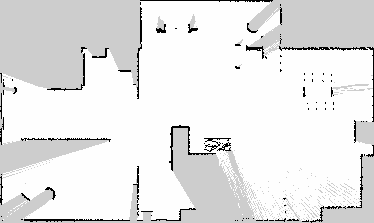
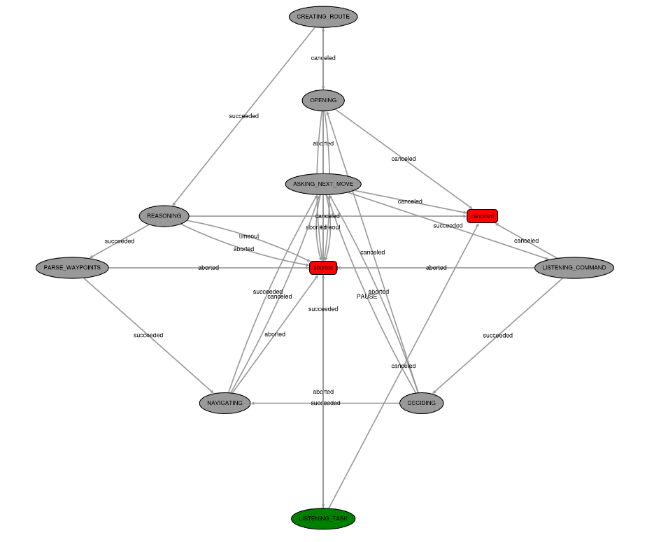
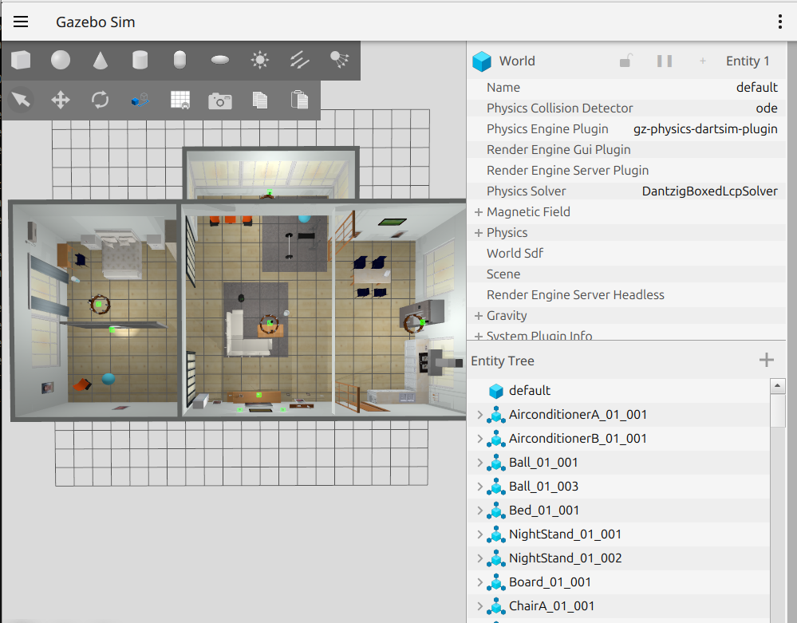
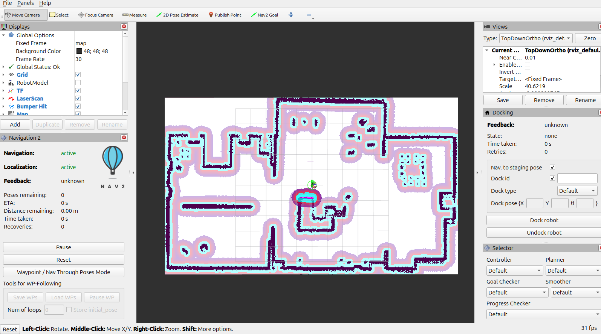

# Service Robot

**Description:** This project integrates a voice chatbot (YASMIN + LLaMA/Whisper/Piper modules) with a navigation stack (Nav2) to enable voice-command-driven motion of a TurtleBot. The demonstration video can be found in the `/media` directory.

**Prerequisites:**
- ROS 2 Jazzy
- Configured CUDA
- Gazebo Harmonic

**Key project packages:**
- `chatbot_bringup` (main launcher)
- `chatbot_ros` (chatbot nodes and states)
- `nav2_playground` (simulator, SLAM, and navigation launcher)

## Navigation Package
The `nav2_playground` package and the environment launcher `playground_kobuki.launch.py` were obtained from the `nav2_playground` and `easynav_playground_kobuki` packages of [EasyNavigation](https://github.com/EasyNavigation/roscon2025_workshop?tab=readme-ov-file), respectively.

## Environment Setup
Install `nav2_playground` dependencies:

```bash
cd proyecto/src
vcs import . < nav2_playground/thirdparty.repos
```

Install `chatbot_ros` dependencies:

```bash
vcs import < chatbot_ros/dependencies.repos

cd llama_ros

pip3 install --break-system-packages -r requirements.txt

cd ..

sudo rosdep init

rosdep update

rosdep install --from-paths src --ignore-src -r -y
```

Build packages from the project root:

```bash
colcon build --cmake-args -DGGML_CUDA=ON

source install/setup.sh
```

## Generate Occupancy Grid Map
Before running the voice-controlled service robot, an occupancy grid map must be generated to compute navigation routes.

Run each of the following commands in a **separate terminal** (from inside the project root and sourced):

1) Launch the **simulation environment**:

```bash
ros2 launch nav2_playground playground_kobuki.launch.py 
```
2) Launch **SLAM Toolbox**:
```bash
ros2 launch nav2_playground slam_launch.py 
```
3) Use the **keyboard** to teleoperate the robot and generate the map:
```bash
ros2 run teleop_twist_keyboard teleop_twist_keyboard
```

Finally, **save** the created map:

```bash
ros2 service call /slam_toolbox/save_map slam_toolbox/srv/SaveMap "name:\n  data: 'map'"
```
Map used during development:

<p align="center">
  
</p>

## Running the Project

### Recommended Method
The main launch file opens a terminal for navigation and the simulator, followed after 10 seconds by another terminal for the chatbot. This delay ensures that Nav2 is active. Running components in separate terminals makes log inspection much easier during execution.

Run the **main launcher**:

```bash
ros2 launch chatbot_bringup main.launch.py
```

Available `ros2 launch` **arguments**:
- `mode` (Default: `sequential`) — `sequential` or `random`. Order of the waypoints that make up the route.
- `yaml_output_path` (Default: `/home/ainara/unileon/servicios/proyecto/waypoints.yaml`) — destination path where the generated route is saved.
- `semantic_path` (Default: `/home/ainara/unileon/servicios/proyecto/semantic.yaml`) — YAML file containing room names and poses.
- `timeout` (Default: `500.0`) — navigation timeout (s).

Example passing arguments:
```bash
ros2 launch chatbot_bringup main.launch.py mode:=random timeout:=300
```

### Alternative Execution (Debug / Individual Nodes)
- Run only the **chatbot**:
```bash
ros2 launch chatbot_bringup chatbot.launch.py 
```
Access the **YASMIN viewer**: http://localhost:5000/



- Run only **Gazebo**:
```bash
ros2 launch nav2_playground playground_kobuki.launch.py 
```
**Simulator** window:




- Run only **Nav2**:
```bash
ros2 launch nav2_playground navigation_launch.py 
```
**RViz:**



## Stopping the Robot on the Move (Canceling a Waypoint)
To manually cancel a waypoint before the robot reaches its destination, call the `/navigate_to_pose/_action/cancel_goal` service with an empty goal ID to cancel all active goals:

```bash
ros2 service call /navigate_to_pose/_action/cancel_goal action_msgs/srv/CancelGoal "{}"
```

## System Design
Below is the design overview of the chatbot subsystem and the finite state machine that governs it.

**Finite State Machine**
- `OPENING` (*SpeakState*): Plays the initial greeting/question.
- `LISTENING TASK` (*ListenState*): Performs speech-to-text (STT) via `/whisper/listen` and stores the transcription in **blackboard.stt**.
- `CREATING ROUTE` (*LoadRouteState*): Sends instructions and the list of available rooms to the LLM (`/llama/generate_response`), parses the YAML response containing **target_rooms**, maps room names to coordinates according to the poses defined in **semantic.yaml**, and saves **waypoints.yaml**.
- `REASONING` (*SpeakState*): Speaks the brief reasoning/explanation returned by the LLM.
- `PARSE WAYPOINTS` (*ParseWaypointsState*): Loads **waypoints.yaml**, creates a **PoseStamped** per waypoint, and populates **blackboard.waypoints**, **blackboard.target_names**, and **blackboard.current_waypoint_index**.
- `NAVIGATING` (*NavigateToWaypointState*): Uses **nav2_simple_commander.BasicNavigator** to navigate to the waypoint. Monitors **distance_remaining** (distance to goal), **number_of_recoveries** (number of route recalculations), and **LaserScan** (`/scan_raw` to check obstacle distance) to dynamically decide which behavior tree (local planner) to deploy.
- `ASKING NEXT MOVE` (*SpeakState*): Asks the user what to do upon arrival or failure (continue, repeat, wait, cancel).
- `LISTENING COMMAND` (*ListenState*): Listens for the control command.
- `DECIDING` (*DecisionState*): Interprets the command and triggers the appropriate transition: **SUCCEED** (next/repeat), **PAUSE** (stop), **CANCEL** (cancel), **ABORT** (unrecognized).

**Key Blackboard Variables**
- `stt`: Recognized text from speech recognition (ASR).
- `tts`: Text to synthesize via TTS.
- `waypoints`: Generated and parsed list of `PoseStamped` goals.
- `current_waypoint_index`: Index of the current waypoint to execute.
- `target_names`: Room names comprising the generated route.
